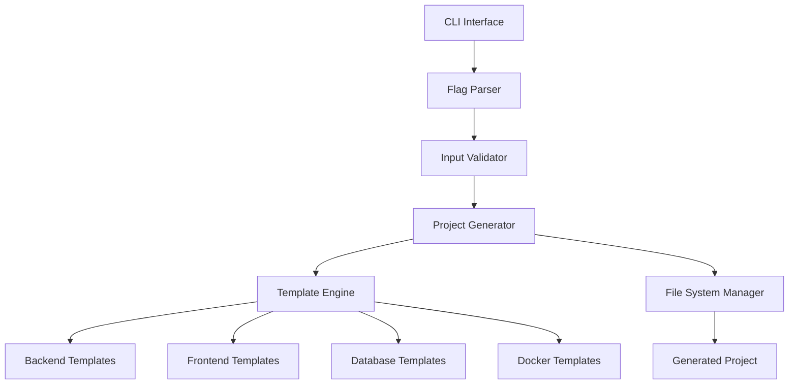

# Design Document

## Overview

The Microservice Bootstrapper is a Go CLI application that generates complete microservice project structures with Docker orchestration. The tool uses a template-based approach to create consistent, production-ready project scaffolding based on user-specified technology stacks.

The application follows a modular architecture with clear separation between CLI handling, template management, and file generation. It leverages Go's strong standard library and popular CLI frameworks to provide a robust, extensible solution.

## Architecture



### Core Components

1. **CLI Interface**: Handles command parsing and user interaction using Cobra framework
2. **Input Validator**: Validates flag combinations and system prerequisites
3. **Project Generator**: Orchestrates the project creation process
4. **Template Engine**: Manages and processes template files for different technologies
5. **File System Manager**: Handles directory creation and file writing operations

## Components and Interfaces

### CLI Layer

```go
type CLIConfig struct {
    Backend   string
    Frontend  string
    Database  string
    ProjectName string
    Force     bool
}

type Command interface {
    Execute() error
    Validate() error
}
```

The CLI layer uses the Cobra framework to handle command parsing, flag validation, and help generation. It provides a clean interface for users and delegates actual work to the generator layer.

### Project Generator

```go
type ProjectGenerator interface {
    Generate(config CLIConfig) error
    ValidateConfig(config CLIConfig) error
    CheckPrerequisites() error
}

type ServiceConfig struct {
    Type        string
    Technology  string
    Port        int
    Environment map[string]string
}
```

The generator orchestrates the entire project creation process, coordinating between template processing and file system operations.

### Template Engine

```go
type TemplateEngine interface {
    ProcessTemplate(templateName string, data interface{}) ([]byte, error)
    GetTemplate(service, technology string) (Template, error)
}

type Template struct {
    Files       map[string]string  // filename -> template content
    Directories []string
    Variables   map[string]interface{}
}
```

Templates are embedded in the binary using Go's embed package, ensuring the tool is self-contained. Each technology stack has its own template set with proper boilerplate code.

### File System Manager

```go
type FileSystemManager interface {
    CreateDirectory(path string) error
    WriteFile(path string, content []byte) error
    FileExists(path string) bool
    IsDirectoryEmpty(path string) bool
}
```

Handles all file system operations with proper error handling and cleanup capabilities.

## Data Models

### Project Structure

```
project-root/
├── docker-compose.yml
├── README.md
├── .env.example
├── .gitignore
├── backend/
│   ├── Dockerfile
│   ├── main.{ext}
│   ├── requirements.txt|package.json|go.mod
│   └── src/
├── frontend/
│   ├── Dockerfile
│   ├── package.json
│   ├── src/
│   └── public/
└── docs/
    └── setup.md
```

### Configuration Model

```go
type ProjectConfig struct {
    Name     string
    Services []ServiceConfig
    Database *DatabaseConfig
    Network  NetworkConfig
}

type DatabaseConfig struct {
    Type     string
    Port     int
    Volume   string
    Environment map[string]string
}

type NetworkConfig struct {
    Name string
    Driver string
}
```

### Template Data Model

```go
type TemplateData struct {
    ProjectName string
    Services    []ServiceConfig
    Database    *DatabaseConfig
    Ports       map[string]int
    Environment map[string]string
}
```

## Error Handling

### Error Types

```go
type ValidationError struct {
    Field   string
    Message string
}

type FileSystemError struct {
    Operation string
    Path      string
    Cause     error
}

type TemplateError struct {
    Template string
    Cause    error
}
```

### Error Handling Strategy

1. **Input Validation**: Validate all user inputs before processing
2. **Prerequisite Checking**: Verify Docker and Docker Compose availability
3. **Graceful Degradation**: Provide helpful error messages with suggestions
4. **Cleanup on Failure**: Remove partially created files if generation fails
5. **Logging**: Provide verbose logging option for debugging

### Recovery Mechanisms

- Rollback partially created projects on failure
- Provide suggestions for fixing common issues
- Validate system requirements before starting generation

## Testing Strategy

### Unit Testing

- **CLI Layer**: Test flag parsing and validation logic
- **Template Engine**: Test template processing with various data inputs
- **File System Manager**: Test file operations with mock file system
- **Project Generator**: Test orchestration logic with mocked dependencies

### Integration Testing

- **End-to-End**: Test complete project generation for each supported stack
- **Docker Integration**: Verify generated Docker Compose files work correctly
- **Template Validation**: Ensure generated projects build and run successfully

### Test Structure

```
tests/
├── unit/
│   ├── cli_test.go
│   ├── generator_test.go
│   ├── template_test.go
│   └── filesystem_test.go
├── integration/
│   ├── e2e_test.go
│   └── docker_test.go
└── fixtures/
    ├── expected_outputs/
    └── test_templates/
```

### Testing Approach

1. **Mock External Dependencies**: Use interfaces to mock file system and external calls
2. **Golden File Testing**: Compare generated output against expected files
3. **Docker Testing**: Use testcontainers to verify Docker Compose functionality
4. **Property-Based Testing**: Test with various input combinations
5. **Performance Testing**: Ensure reasonable generation times for large projects

### Continuous Integration

- Run tests on multiple Go versions
- Test on different operating systems (Linux, macOS, Windows)
- Validate generated projects can be built and run
- Check for security vulnerabilities in dependencies